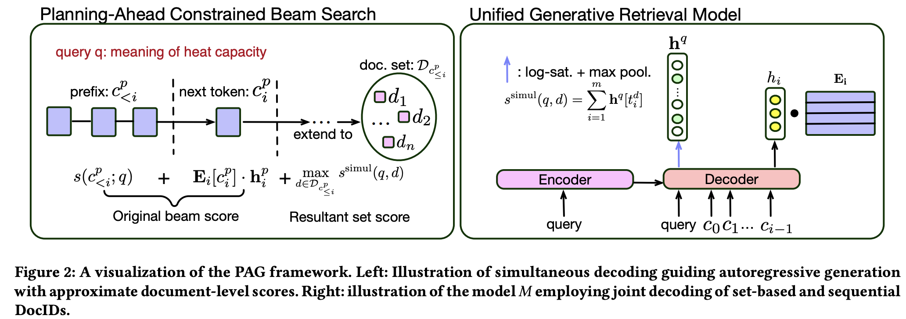

# PAG
This repo provides the source code and checkpoints for our paper [Planning Ahead in Generative Retrieval: Guiding Autoregressive Generation through Simultaneous Decoding](https://arxiv.org/pdf/2404.14600.pdf). 
We introduces PAG–a novel optimization and decoding approach that guides autoregressive generation of document identifiers in generative retrieval models through simultaneous decoding. To this aim, PAG constructs a set-based and sequential identifier for each document. Motivated by the bag-of-words assumption in information retrieval, the set-based identifier is built on lexical tokens. The sequential identifier, on the other hand, is obtained via quantizing relevance-based representations of documents. Extensive experiments on MSMARCO and TREC Deep Learning Track data reveal that PAG outperforms the state-of-the-art generative retrieval model by a large margin (e.g., 15.6% MRR improvements on MS MARCO), while achieving 22x speed up in terms of query latency.


<p align="center">
  
</p>


## Package installation
- pip install -r requirements.txt 
- pip install torch==1.10.0+cu111 -f https://download.pytorch.org/whl/torch_stable.html
- conda install -c conda-forge faiss-gpu 

## Download Files
All necessary files and checkpoint are in [PAG-data](https://drive.google.com/drive/folders/1q8FeHQ6nxPYpl1Thqw8mS-2ndzf7VZ9y?usp=sharing).
If only want to do inference, you only need to download the following files or folders.
- Trained model: 
    - `experiments-full-lexical-ripor/lexical_ripor_direct_lng_knp_seq2seq_1`
- Files for sequential and set-based DocIDs: 
    - `experiments-full-lexical-ripor/t5-full-dense-1-5e-4-12l/aq_smtid/docid_to_tokenids.json`
    - `experiments-splade/t5-splade-0-12l/top_bow/docid_to_tokenids.json`
- MS MARCO data
    - `msmarco-full/full_collection`, `msmarco-full/TREC_DL_2019/`, `msmarco-full/TREC_DL_2020/queries_2020/`, `msmarco-full/dev_qrel.json`

## Inference 
We use a single 80GB A100 to run the script. Feel free to use other types of GPUs, such as V100, but it would be slower.
Make sure that the `task` variable in line 1 of `full_scripts/full_lexical_ripor_evaluate.sh` is set to `lexical_constrained_retrieve_and_rerank`, then run:
```
bash full_scripts/full_lexical_ripor_evaluate.sh
```


## Training 
All experiments are conducted 8x 40GB A100 GPUs. The whole training pipeline contains three stages: (1) Generative retrieval (GR) model  for set-based DocIDs. (2) GR model for sequence-based DocIDs. (3) Unified GR model for set-based & sequence-based DocIDs. Stages (1) and (2) can be train in parallel. 

### Stage 1: GR model for set-based DocIDs
The stage contains 2 phases: pre-training and fine-tunining. For pre-training, we train the GR model as a sparse encoder, then we select the top m words from the sparse vector for each document $d$ to form the set-based DocID, and we term it as $\{t^d_1, \ldots t^d_m \}$. For fine-tuning phase, we train the GR model for set-based DocID prediction.

#### Pre-training:
Run script for training the sparse encoder: 
```
bash full_scripts/t5_splade_train.sh 
```
Once model trained, run the following script to get the set-based DocIDs:
```
bash full_scripts/t5_splade_get_bow_rep.sh
```

#### Fine-tuning:
We apply the two-step fine-tuning stragegy. The negatives for the step 1 is from BM25, and the negatives for the step 2 is from the step 1 model itself.
For step 1 training: 
- please first set `finetune_step=bm25_neg` in file `full_scripts/t5_full_term_encoder_train.sh`, then run:
```
full_scripts/t5_full_term_encoder_train.sh
```
For step 2 training: 
- We need to mine the negative documents using step 1 model (named as `t5-term-encoder-0-bow-12l`) and assign the teacher score using a cross-encoder for each query-document pair. The procedures are integreted in the script `full_scripts/t5_full_term_encoder_evaluate.sh`, when we set `task="retrieve_train_queries"` in line 3 of the script:
```
bash full_scripts/t5_full_term_encoder_evaluate.sh
```
- After running the script, you should obtain a train file in the path `/YOU_PREFIX/t5-term-encoder-0-bow-12l/out/MSMARCO_TRAIN/qid_pids_rerank_scores.train.json`. Then run the following .py script to add the qrel document (if missed) to the `qid_pids_rerank_scores.train.json` (Remember to set `experiment_names = ["t5-term-encoder-0-bow-12l"]` in line 13 of the .py file.):
```
python t5_pretrainer/full_preprocess/add_qrel_to_rerank_run.py
```

- You will obtain the final train file:
`/YOU_PREFIX/t5-term-encoder-0-bow-12l/out/MSMARCO_TRAIN/qrel_added_qid_docids_teacher_scores.train.json`. Please first set `finetune_step=self_neg` in file `full_scripts/t5_full_term_encoder_train.sh`, then train the step 2 model:
```
bash full_scripts/t5_full_term_encoder_train.sh
```

### Stage 2: GR model for sequence-basded DocIDs
The stage also contains pre-training and fine-tuning phases. And the training pipline is the same as RIPOR [https://arxiv.org/pdf/2311.09134.pdf] except we don't use progressive training (We found the progressive training requires too much training time, and do not significantly influence the model effectiveness).

#### pre-training 
We treat the GR mdoel as a dense encoder and apply the two-step training strategy:

For step 1:
-  please first set `finetune_step=bm25_neg` in file `full_scripts/t5_full_dense_train.sh`, then run:
```
bash full_scripts/t5_full_dense_train.sh
```
For step 2:
- First, we need to mine the negative documents using the step 1 model (named `t5-full-dense-0-5e-4-12l`t5-full-dense-0-5e-4-12l). Set `task=retrieve_train_queries` in the line 2 of script `full_scripts/t5_full_dense_evaluate.sh `, then run:
```
bash full_scripts/t5_full_dense_evaluate.sh 
```
- The mined negative document file should be in the path `/YOU_PREFIX/experiments-full-lexical-ripor/out/MSMARCO_TRAIN/run.json`. Next, we apply the cross-encoder to assign the teacher scores for the file: 
```
bash full_scripts/rerank_for_create_trainset.sh
```
- You should obtain a file in the path `/YOU_PREFIX/experiments-full-lexical-ripor/out/MSMARCO_TRAIN/qid_docids_teacher_scores.train.json`. Set `experiment_names = ["t5-full-dense-0-5e-4-12l"]` in the line 13 of .py file `t5_pretrainer/full_preprocess/add_qrel_to_rerank_run.py`, then run:
```
python t5_pretrainer/full_preprocess/add_qrel_to_rerank_run.py
``` 
- You will obtain the trained file `/YOU_PREFIX/experiments-full-lexical-ripor/out/MSMARCO_TRAIN/qrel_added_qid_docids_teacher_scores.train.json`. To train the step 2 model,  please first set `finetune_step=self_neg` in the line 8 of file `full_scripts/t5_full_dense_train.sh`, then run:
```
bash full_scripts/t5_full_dense_train.sh
```

- After training we can run the following script to obtain sequence-based DocIDs. please first set `task=all_aq_pipline` in file `full_scripts/t5_full_dense_evaluate.sh`, then run:
```
bash full_scripts/t5_full_dense_evaluate.sh 
``` 
- As shown in the paper, seq2seq pre-training can improve the GR model performance. Run the following script for training:
```
bash full_scripts/full_ripor_initial_train.sh
```

#### fine-tuning 
Let us apply the rank-oriented fine-tuning in this stage. Please run the script:
```
bash full_scripts/full_ripor_direct_lng_knp_train.sh
```

### Stage 3: Unified GR model for set-based & sequence-based DocIDs
We need to the merge weights of the above two trained GR models. 

First, move your terminal current directory to `t5_pretrainer`:
```
cd t5_pretrainer
```

Second, run the following code to merge weiths:
```
python -m full_preprocess.merge_model_weights
```

Third, move your terminal current directory back:
```
cd ..
```

Now, we can finally fine-tune the model. Run the following script:
```
bash full_scripts/full_lexical_ripor_train.sh
```


